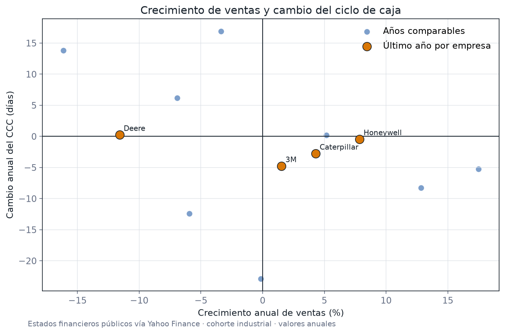

[← Volver al portfolio](../../README.md)

# Rentabilidad no es caja

## 1. Título y pitch

**Rentabilidad no es caja — Radar de capital de trabajo**

Detecta cuándo una empresa crece a costa de inmovilizar efectivo en clientes o inventarios, antes de que el deterioro aparezca como una crisis de liquidez.

**Decisión que habilita:** priorizar acciones sobre cobranzas, inventario, condiciones comerciales o negociación con proveedores.

## Evidencia ejecutada

El caso ya no es solo una propuesta: incluye una muestra reproducible de **16 estados financieros anuales de cuatro compañías industriales (2022–2025)**, cálculo verificable de DSO, DIO, DPO, CCC y flujo de caja libre, pruebas unitarias y resultados versionados.

En el último período comparable, Deere fue la única empresa de la cohorte cuyo CCC se deterioró, aunque apenas **0,22 días**. Esa variación representa aproximadamente **USD 26,8 millones** de caja absorbida por capital de trabajo; al mismo tiempo, las otras tres compañías redujeron su ciclo.



**Cómo verificarlo**

```bash
python -m portfolio_analytics.working_capital
pytest tests/test_working_capital.py
```

Archivos auditables: [datos](data/sample.csv), [trazabilidad de la fuente](data/source.json), [métricas por empresa](outputs/company_metrics.csv), [métricas de portada](outputs/metrics.json) y [código del análisis](../../src/portfolio_analytics/working_capital.py).

## 2. Fuente de datos

**Muestra incluida:** estados financieros públicos obtenidos mediante Yahoo Finance/yfinance para Caterpillar, Deere, 3M y Honeywell. El manifiesto versionado conserva URL, fecha, método y hash del archivo.

**Fuente oficial para refrescar y ampliar:** [SEC Financial Statement Data Sets](https://www.sec.gov/data-research/sec-markets-data/financial-statement-data-sets), extraídos de estados financieros presentados en XBRL.

**Acceso alternativo para una primera versión:** [SEC EDGAR Companyfacts API](https://www.sec.gov/search-filings/edgar-application-programming-interfaces), que permite consultar hechos XBRL por empresa sin descargar todos los archivos trimestrales.

Alcance recomendado:

- entre 8 y 15 empresas de un mismo subsector SIC;
- 12 trimestres completos;
- formularios 10-Q y 10-K;
- unidad de análisis: `empresa × trimestre fiscal`.

Variables mínimas: ventas, costo de ventas, cuentas por cobrar, inventarios, cuentas por pagar, caja, flujo operativo y compras de propiedades/planta/equipo. Como los emisores pueden usar etiquetas XBRL distintas, se construye una tabla de correspondencia entre concepto económico y tags aceptados.

## 3. Preguntas de negocio

- ¿El crecimiento de ventas se está convirtiendo en caja o está financiando más capital de trabajo?
- ¿Qué componente explica el deterioro: días de cobro, días de inventario o días de pago?
- ¿Qué empresas se alejan de la mediana de su subsector y desde cuándo?
- ¿Una mejora de caja es operativa o proviene de extender pagos a proveedores?
- ¿Qué señales aparecieron antes de una caída del flujo operativo?
- Si DSO o DIO volvieran a la mediana histórica, ¿cuánta caja se liberaría?

**KPI principal:** ciclo de conversión de caja, acompañado por flujo operativo/EBITDA y caja potencialmente liberable.

## 4. Stack técnico

- **SQL (DuckDB o PostgreSQL):** staging de `SUB`, `NUM` y tabla de mapeo XBRL; selección de períodos y deduplicación.
- **Python + Pandas:** normalización de hechos, cálculo de promedios de saldos, validaciones y escenarios.
- **SciPy o statsmodels:** tendencia robusta y comparación con mediana sectorial.
- **Power BI o Tableau:** dashboard CFO con drill-down empresa → trimestre → componente.
- **Git + notebook parametrizado:** ejecución reproducible por período y lista de CIK.

## 5. Estructura del análisis

### Paso 1 — Acotar la comparación

Elegir un solo subsector y documentar su lógica económica. Evitar mezclar fabricantes, software y retailers: sus inventarios, márgenes y condiciones de pago no son comparables.

### Paso 2 — Ingesta y contrato de datos

Descargar los trimestres elegidos o consultar Companyfacts respetando la identificación solicitada por la SEC. Guardar un manifiesto con URL, fecha de descarga, trimestre y hash del archivo.

Construir:

- `dim_company(cik, ticker, name, sic, fiscal_year_end)`;
- `fact_xbrl(cik, period_end, form, filed_at, concept, value, unit, quarters)`;
- `map_concept(canonical_metric, accepted_tag, statement_type, sign_rule)`.

### Paso 3 — Calidad y limpieza

- conservar USD y estados consolidados;
- separar hechos instantáneos de hechos de duración;
- preferir la presentación más reciente de cada período y controlar enmiendas;
- detectar duplicados por empresa, concepto, período y formulario;
- revisar signos y escalas;
- comparar una muestra contra el 10-Q/10-K renderizado;
- medir cobertura de tags por empresa antes de calcular KPIs.

No se rellena con cero un concepto faltante. Si no se puede mapear con evidencia, queda nulo y se informa.

### Paso 4 — Métricas contables

Usar saldos promedio de apertura y cierre cuando estén disponibles:

```text
DSO = cuentas por cobrar promedio / ventas × días del período
DIO = inventario promedio / costo de ventas × días del período
DPO = cuentas por pagar promedio / costo de ventas × días del período
CCC = DSO + DIO − DPO
Conversión de caja = flujo operativo / EBITDA
Caja libre aproximada = flujo operativo − capex
```

La aproximación de DPO con costo de ventas debe explicitarse: compras sería el denominador económico ideal, pero no siempre se informa.

### Paso 5 — EDA y diagnóstico

- tendencia trimestral y variación interanual;
- distribución por compañía y comparación contra mediana sectorial;
- puente del cambio de capital de trabajo;
- relación entre crecimiento de ventas y cambio del CCC;
- identificación de cambios persistentes, no de un único trimestre;
- revisión de estacionalidad fiscal.

### Paso 6 — Escenarios

Estimar caja liberable si DSO y DIO regresaran a:

1. la mediana propia de 12 trimestres;
2. la mediana del subsector;
3. una mejora conservadora de cinco días.

Presentar escenarios, no una promesa de caja: parte del saldo puede estar vencido, restringido o vinculado al crecimiento.

### Paso 7 — Storytelling y recomendación

Organizar la historia en tres actos: “crece”, “la caja no acompaña” y “este componente explica la brecha”. Cerrar con una acción, su impacto estimado y la limitación principal.

### Controles metodológicos

- Comparar empresas del mismo modelo de negocio y calendario fiscal.
- No interpretar una etiqueta XBRL personalizada sin revisar su definición.
- Separar cambios operativos de adquisiciones, reclasificaciones o estacionalidad.
- Mantener valores originales junto a los normalizados.
- Tratar los datos SEC como “as filed”, no como una base auditada y homogeneizada por el analista.

## 6. Visualización final

Un **dashboard CFO de una página**:

- tarjetas: ventas, flujo operativo, CCC, variación de CCC y caja liberable estimada;
- gráfico principal: dispersión `crecimiento de ventas vs. cambio del CCC`, con tamaño por ventas y color por empresa;
- puente: contribución de DSO, DIO y DPO al cambio anual del CCC;
- small multiples: DSO, DIO y DPO por trimestre contra mediana sectorial;
- tabla de excepciones: empresas con dos o más trimestres de deterioro.

El gráfico que debe abrir la presentación es la dispersión: separa crecimiento saludable de crecimiento que absorbe caja.

## 7. Frase para el portfolio

> “El margen se mantuvo, pero la caja contó otra historia: el CCC aumentó **[X días]**, explicado principalmente por **[componente]**, lo que inmovilizó aproximadamente **[importe]**. Volver a la mediana histórica liberaría **[Y%]** de ese monto.”

**Insight ejecutado:** “Deere fue la única compañía de la cohorte cuyo ciclo de caja empeoró en 2025: el aumento fue pequeño —0,22 días— pero equivale a aproximadamente USD 26,8 millones de caja absorbida. El resultado muestra por qué un CFO debe traducir días operativos a impacto monetario antes de priorizar una intervención.”

## 8. Nivel de dificultad

**Nivel 1 de 5 — Fundamentos con criterio contable.**

La dificultad técnica se mantiene acotada con pocas empresas y conceptos canónicos. La señal profesional está en calcular correctamente los ratios, respetar la comparabilidad y traducirlos a una decisión de liquidez.

### Entregables

- script de descarga o instrucciones Companyfacts;
- diccionario y mapeo XBRL;
- consultas de staging;
- notebook de calidad y KPIs;
- dataset analítico empresa-trimestre;
- dashboard y memo ejecutivo de una página.

### Criterio de finalización

El proyecto está listo cuando todos los KPIs de una muestra de dos empresas y cuatro trimestres concilian con sus filings, el dashboard explica qué componente mueve la caja y cada recomendación declara su supuesto.
