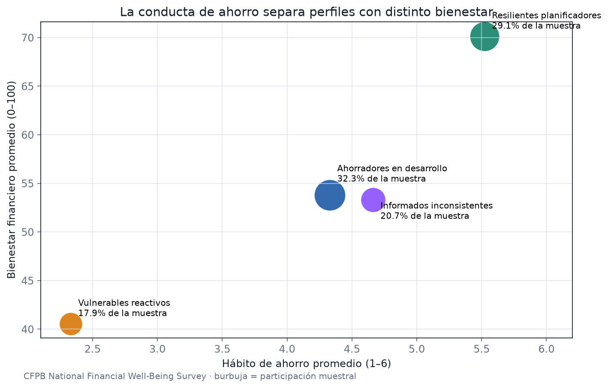

[← Volver al portfolio](../../README.md)

# La brecha entre saber y hacer

## 1. Título y pitch

**La brecha entre saber y hacer — Segmentación financiera conductual**

Identifica por qué clientes con recursos parecidos toman decisiones financieras distintas y traduce esas diferencias en intervenciones más útiles que una segmentación basada solo en ingreso o edad.

**Decisión que habilita:** adaptar mensajes, herramientas y productos al obstáculo conductual dominante de cada segmento.

## Evidencia ejecutada

El análisis utiliza las **6.394 respuestas** del archivo público del CFPB, convierte códigos de no respuesta a nulos, conserva pesos muestrales y asigna 6.255 casos completos a cuatro segmentos. El clustering alcanza una estabilidad media **ARI de 0,945** entre semillas y la regresión ponderada explica el **50,9%** de la variación observada en bienestar.

La brecha entre “Vulnerables reactivos” y “Resilientes planificadores” es de **29,6 puntos** de bienestar. La capacidad de absorber un shock fue la asociación estandarizada más fuerte: el producto debería priorizar automatización y resiliencia antes que sumar contenido educativo genérico.



**Cómo verificarlo**

```bash
python -m portfolio_analytics.behavioral_finance
pytest tests/test_behavioral_finance.py
```

Archivos auditables: [notebook ejecutado](notebooks/analysis.ipynb), [muestra](data/sample.csv), [trazabilidad](data/source.json), [perfiles](outputs/segment_profiles.csv), [asignaciones](outputs/respondent_segments.csv), [métricas](outputs/metrics.json) y [código](../../src/portfolio_analytics/behavioral_finance.py).

## 2. Fuente de datos

**Fuente real y pública:** [CFPB National Financial Well-Being Survey](https://www.consumerfinance.gov/data-research/financial-well-being-survey-data/).

La CFPB publica:

- archivo de uso público en CSV, sin identificación personal;
- guía del usuario;
- codebook con variables y estadísticas;
- código de carga para Python, R, SAS, SPSS y Stata.

La encuesta combina una escala validada de bienestar financiero con características del hogar, ahorro y colchones de seguridad, experiencias financieras, conductas, habilidades y actitudes.

**Unidad de análisis:** persona encuestada.

**Regla de inferencia:** usar los pesos provistos para estimaciones descriptivas poblacionales y declarar cuándo un algoritmo de segmentación trabaja sin ponderación.

## 3. Preguntas de negocio

- ¿Cuánto cambia el bienestar financiero entre personas con ingresos similares pero hábitos distintos?
- ¿Existe una brecha entre conocimiento objetivo y confianza percibida?
- ¿Qué combinación de planificación, ahorro y resiliencia distingue a los perfiles con mayor bienestar?
- ¿Qué segmentos parecen enfrentar falta de capacidad, falta de hábito, exceso de confianza o alta fragilidad?
- ¿Qué intervención sería más razonable para cada segmento: automatización, simplificación, feedback, compromiso o educación?
- ¿Los segmentos se mantienen cuando cambia la semilla, la muestra o el número de grupos?
- ¿Qué variables explican diferencias dentro de cada nivel de ingreso?

**KPI principal:** puntaje de bienestar financiero, analizado junto con ahorro de emergencia, conducta de planificación y brecha confianza-conocimiento.

## 4. Stack técnico

- **Python + Pandas:** diccionario, limpieza, recodificación y análisis ponderado.
- **scikit-learn:** preprocessing, clustering y validación de estabilidad.
- **statsmodels:** regresión interpretable con controles y errores estándar adecuados.
- **SciPy:** comparaciones de distribución y sensibilidad.
- **Tableau o Power BI:** perfiles de segmento y diseño de intervenciones.
- **Jupyter:** notebook narrativo con hipótesis previas al modelado.

## 5. Estructura del análisis

### Paso 1 — Marco conductual

Definir dimensiones antes de mirar los clusters:

1. **capacidad:** ingreso, empleo y holgura financiera;
2. **resiliencia:** ahorro de emergencia y capacidad de absorber shocks;
3. **planificación:** horizonte, presupuesto y conducta de ahorro;
4. **conocimiento:** desempeño en preguntas objetivas;
5. **autoconfianza:** evaluación subjetiva de habilidad;
6. **experiencia:** eventos financieros adversos.

No etiquetar sesgos clínicamente. “Present bias” u “overconfidence” se tratan como hipótesis interpretativas respaldadas por proxies, no como variables observadas directamente.

### Paso 2 — Calidad y preparación

- importar códigos especiales como valores faltantes, no como categorías ordinales;
- aplicar etiquetas del codebook;
- revisar patrones de no respuesta;
- distinguir variables ordinales, nominales y continuas;
- winsorizar solo si hay justificación y conservar el original;
- crear una tabla con población ponderada y muestra sin ponderar;
- documentar qué preguntas alimentan cada dimensión.

### Paso 3 — EDA con comparación justa

- distribución ponderada del bienestar;
- bienestar por quintil de ingreso;
- relación entre colchón de emergencia y bienestar dentro de cada quintil;
- matriz de conocimiento objetivo vs. confianza subjetiva;
- conductas de planificación controlando capacidad económica;
- intervalos, tamaño muestral efectivo y denominadores visibles.

### Paso 4 — Construcción de segmentos

Crear puntajes de dimensión estandarizados y con sentido interpretable. Aplicar un pipeline reproducible:

1. imputación documentada;
2. one-hot para nominales;
3. estandarización;
4. reducción opcional solo para diagnóstico visual;
5. K-Means o clustering jerárquico sobre dimensiones, no sobre decenas de respuestas crudas;
6. comparación de 3 a 6 segmentos.

Elegir la solución por estabilidad y utilidad de acción, no únicamente por el silhouette score.

Ejemplo de nombres que deben validarse con los datos:

- planificadores resilientes;
- capaces pero postergadores;
- confiados sin red de seguridad;
- frágiles y sobrecargados.

Los nombres describen patrones agregados; no juzgan a las personas.

### Paso 5 — Validación estadística

- repetir el clustering con varias semillas y bootstrap;
- medir estabilidad de asignación;
- comparar segmentos con variables no usadas para formarlos;
- estimar una regresión del bienestar sobre dimensiones y controles sociodemográficos;
- reportar coeficientes, intervalos y ajuste;
- ejecutar sensibilidad con y sin pesos y con distintas decisiones de imputación.

La regresión ayuda a describir asociaciones. No demuestra que una conducta cause el bienestar observado.

### Paso 6 — Diseño de intervención

Traducir cada perfil a una fricción y una intervención:

| Fricción dominante | Intervención candidata | Métrica de experimento |
|---|---|---|
| Postergación | Ahorro automático con opción de salida | Activación y permanencia a 90 días |
| Sobrecarga | Menos opciones y próximo paso único | Finalización de tarea |
| Exceso de confianza | Feedback comparativo y simulación de shock | Creación de fondo de emergencia |
| Baja capacidad | Producto flexible y derivación a apoyo | Reducción de episodios de falta de liquidez |

Las intervenciones se presentan como hipótesis para un A/B test futuro, no como eficacia probada por la encuesta.

### Paso 7 — Storytelling

Contrastar dos personas con ingreso comparable y resultados distintos. Mostrar que la segmentación demográfica explica “quién”, mientras la conductual ayuda a decidir “qué hacer”.

### Controles metodológicos

- Respetar diseño y pesos de encuesta en inferencia descriptiva.
- No utilizar segmentos para excluir, encarecer crédito o tomar decisiones adversas.
- Revisar diferencias por grupos protegidos y posibles efectos discriminatorios.
- No confundir correlación, perfil y causalidad.
- Publicar solo agregados con tamaños suficientes.
- Documentar todas las variables que forman cada score.

## 6. Visualización final

Un **mapa de segmentos conductuales**:

- gráfico principal: cuadrante `conocimiento objetivo × confianza percibida`, con tamaño por población ponderada y color por segmento;
- radar o dot plot de las seis dimensiones por segmento;
- distribución de bienestar e ingreso dentro de cada grupo;
- barras de resiliencia y conducta de ahorro;
- tarjetas de intervención: fricción, acción, métrica y riesgo ético;
- filtros por edad, ingreso y experiencia adversa.

Preferir dot plots al radar si se necesita comparar con precisión. El cuadrante debe abrir la historia porque hace visible la brecha entre saber, creer y actuar.

## 7. Frase para el portfolio

> “La brecha entre los perfiles extremos fue de 29,6 puntos de bienestar y la capacidad de absorber un shock mostró la asociación estandarizada más fuerte. La oportunidad no es dar más información a todos, sino adaptar automatización, simplificación y construcción de resiliencia a la fricción de cada segmento.”

“Asociada” es deliberado: el diseño observacional no autoriza lenguaje causal.

## 8. Nivel de dificultad

**Nivel 3 de 5 — Estadística y economía conductual aplicadas.**

La dificultad está en combinar medición, segmentación, pesos de encuesta, interpretación prudente y diseño de acción sin convertir un cluster en una caricatura.

### Entregables

- notebook de calidad y EDA ponderada;
- diccionario de dimensiones conductuales;
- pipeline de segmentación;
- reporte de estabilidad y sensibilidad;
- dashboard;
- ficha de intervención y salvaguardas por segmento.

### Criterio de finalización

El proyecto está listo cuando los segmentos son estables, distinguibles y accionables; cada nombre puede justificarse con variables observadas; y las recomendaciones diferencian claramente evidencia descriptiva de hipótesis experimental.
