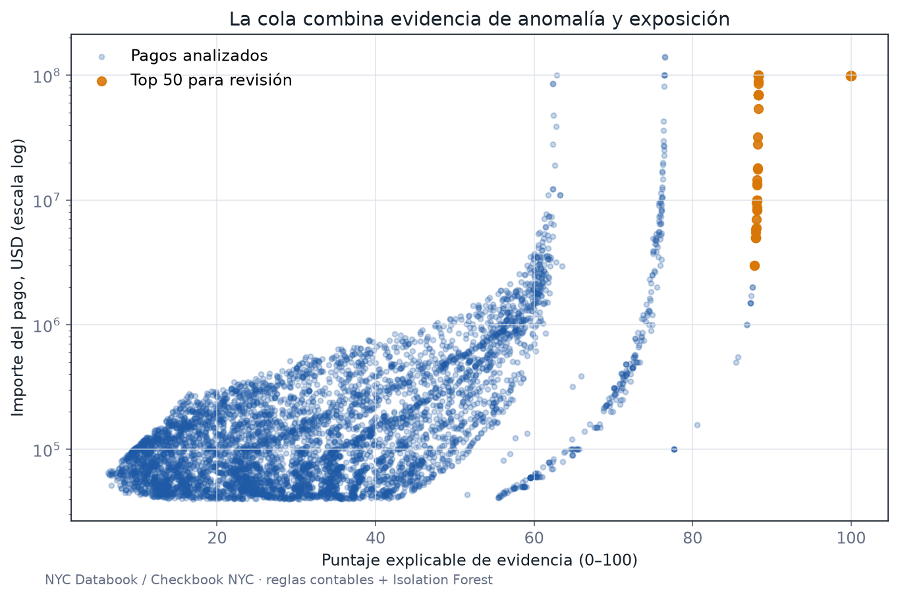

[← Volver al portfolio](../../README.md)

# Cada peso deja una huella

## 1. Título y pitch

**Cada peso deja una huella — Monitoreo inteligente de gastos**

Transforma pagos y contratos públicos en una cola de revisión explicable, para que Auditoría investigue primero las operaciones con mayor exposición y evidencia acumulada.

**Decisión que habilita:** seleccionar qué pago, proveedor o patrón revisar, con una razón trazable y sin confundir una señal estadística con fraude.

## Evidencia ejecutada

El pipeline procesa **25.000 pagos reales del ejercicio fiscal 2024**, pertenecientes a 80 agencias y 4.021 beneficiarios. Combina cuatro reason codes contables con Isolation Forest y materialidad; cada alerta conserva las señales que justifican su posición.

La cola reduce el universo a **250 casos (1%)** que concentran **USD 6.742 millones** de los USD 16.161 millones observados. En una validación controlada recuperó **92%** de las anomalías inyectadas. El primer caso es un pago a “STATE OF NEW YORK”; eso significa “revisar documentación”, no “fraude”.



**Cómo verificarlo**

```bash
python -m portfolio_analytics.spend_anomalies
pytest tests/test_spend_anomalies.py
```

Archivos auditables: [muestra](data/sample.csv), [trazabilidad](data/source.json), [cola con reason codes](outputs/review_queue.csv), [métricas](outputs/metrics.json) y [código](../../src/portfolio_analytics/spend_anomalies.py).

## 2. Fuente de datos

**Muestra incluida:** [NYC Databook](https://databook.nyc/procurement/data-sources), un dataset público derivado de Checkbook NYC y publicado en Parquet. La muestra conserva la URL exacta del objeto, fecha, criterio y hash.

**Fuente oficial para ampliar:** [Checkbook NYC Data Feeds API](https://www.checkbooknyc.com/data-feeds/api).

La API expone datos de presupuesto, contratos, nómina, ingresos y gasto de la Ciudad de Nueva York. Para este proyecto se combinan los dominios de **spending** y **contracts**.

Alcance recomendado:

- cuatro ejercicios fiscales completos y el actual;
- agencias de la ciudad, excluyendo nómina en la primera versión;
- paginación de hasta 20.000 registros por llamada según la documentación;
- conservación de la respuesta XML cruda;
- unidad principal: transacción de gasto o cheque;
- unidades secundarias: proveedor-mes, proveedor-agencia-año y contrato.

El pipeline debe poder ejecutarse sobre una sola agencia para desarrollo y escalar después a la ciudad completa.

## 3. Preguntas de negocio

- ¿Qué pagos parecen duplicados exactos o casi duplicados?
- ¿Existen compras repetidas y próximas en el tiempo que podrían representar fraccionamiento?
- ¿Qué proveedores concentran una parte material del gasto de una agencia o categoría?
- ¿Qué proveedores nuevos muestran un crecimiento inusual sin historia comparable?
- ¿Qué pagos se apartan del patrón de su agencia, categoría, contrato y período?
- ¿Dónde hay picos de fin de ejercicio que merecen una revisión documental?
- ¿Qué alertas combinan varias señales independientes?
- Con capacidad limitada, ¿qué casos maximizan exposición revisada y calidad de evidencia?

**KPI principal:** importe material priorizado por cada 100 casos revisados, acompañado por precisión de la cola y tiempo hasta resolución.

## 4. Stack técnico

- **Python (`requests`, `lxml`):** cliente API, paginación, reintentos y persistencia raw.
- **DuckDB + SQL:** modelo analítico, controles, agregaciones y consultas sobre archivos columnares.
- **Pandas + RapidFuzz:** normalización y similitud de proveedores y descripciones.
- **scikit-learn:** Isolation Forest como señal complementaria.
- **Great Expectations o pruebas SQL:** calidad de ingesta.
- **Tableau o Power BI:** cockpit de auditoría.
- **GitHub Actions opcional:** actualización programada y ejecución de controles.

## 5. Estructura del análisis

### Paso 1 — Definir el riesgo y la acción

Crear un catálogo de señales antes de modelar:

| Riesgo | Señal observable | Evidencia requerida para cerrar |
|---|---|---|
| Pago duplicado | proveedor, importe y fecha iguales o muy cercanos | factura, orden y reversos |
| Duplicado aproximado | descripción similar, mismo importe y ventana temporal | documentos de ambas operaciones |
| Fraccionamiento | múltiples pagos próximos alrededor de un umbral configurable | política de compra y contrato |
| Concentración | alta participación de un proveedor en un peer group | justificación y competencia |
| Desvío de contrato | gasto sin referencia o fuera del patrón contractual | contrato y modificaciones |
| Anomalía de comportamiento | combinación atípica de monto, frecuencia y timing | revisión contextual |

El proyecto detecta señales. Solo una revisión documental puede determinar error, excepción válida o irregularidad.

### Paso 2 — Ingesta resistente

- construir requests XML según cada dominio;
- paginar con `records_from` y `max_records`;
- registrar endpoint, parámetros, timestamp, cantidad y hash;
- guardar raw inmutable por fecha de extracción;
- reintentar únicamente errores transitorios;
- evitar duplicados entre cargas mediante una clave de negocio y hash de fila;
- producir Parquet particionado por ejercicio y agencia.

Un manifiesto debe demostrar que ninguna página se omitió y que el total raw concilia con el staging.

### Paso 3 — Modelo contable

Crear:

```text
dim_vendor
dim_agency
dim_expense_category
dim_contract
dim_date
fact_spend
fact_contract
bridge_vendor_identity
fact_alert
fact_review_outcome
```

Conservar identificadores y nombres originales. `bridge_vendor_identity` vincula variantes normalizadas sin borrar la evidencia de origen.

### Paso 4 — Limpieza y calidad

- tipos, fechas y montos válidos;
- anulaciones y ajustes separados de pagos;
- normalización de mayúsculas, sufijos legales y espacios en proveedores;
- detección de IDs compartidos o nombres ambiguos;
- referencias a contrato y agencia;
- cobertura de campos por período;
- conciliación de conteo e importe por lote;
- revisión de cambios de esquema de la API.

No sumar débitos y reversos como dos egresos. La lógica de signo debe estar documentada y probada.

### Paso 5 — Controles determinísticos

Implementar reglas con reason codes:

1. duplicado exacto;
2. importe/proveedor repetido dentro de una ventana;
3. similitud de descripción y monto;
4. secuencia de compras debajo de un umbral configurable;
5. concentración HHI y participación por proveedor;
6. salto de gasto frente a la historia del peer group;
7. gasto de fin de ejercicio fuera de patrón;
8. pago sin vínculo contractual cuando el vínculo sea esperable.

La Ley de Benford puede incorporarse solo como señal exploratoria sobre poblaciones adecuadas: muchos valores positivos, distintos órdenes de magnitud y sin mínimos, máximos o precios fijados. Nunca debe producir una acusación por sí sola.

### Paso 6 — Features comparables

Calcular por transacción:

- log del importe y percentil dentro de `agencia × categoría × ejercicio`;
- frecuencia del proveedor en 7, 30 y 90 días;
- importe acumulado y concentración;
- antigüedad del proveedor;
- distancia al importe habitual;
- similitud con pagos cercanos;
- días hasta fin de ejercicio;
- relación con valor y vigencia de contrato;
- cantidad y severidad de reglas activadas.

Las features deben usar solo información disponible hasta la fecha de monitoreo para permitir un backtest honesto.

### Paso 7 — Anomalía estadística

Entrenar Isolation Forest dentro de grupos suficientemente comparables o incluir el peer group en el diseño. Evitar un único modelo que trate como iguales a categorías estructuralmente distintas.

Validar mediante:

- estabilidad del ranking entre ventanas;
- inspección estratificada de top casos y muestra aleatoria;
- anomalías sintéticas inyectadas en una copia de los datos;
- precisión en el top `K` que Auditoría puede revisar;
- sensibilidad a parámetros y tamaño del peer group.

El parámetro de contaminación define una capacidad de revisión, no una supuesta tasa real de fraude.

### Paso 8 — Puntaje híbrido

Combinar:

```text
priority_score =
exposición_material_normalizada
× (severidad_reglas + percentil_anomalía + evidencia_cruzada)
× factor_revisabilidad
```

Cada fila debe mostrar:

- señal o señales activas;
- monto expuesto;
- peer group;
- valores comparables;
- documentos necesarios;
- acción y responsable sugeridos.

Las reglas de alta evidencia, como un duplicado exacto no revertido, deben poder superar al modelo.

### Paso 9 — Workflow de revisión

Estados: `nuevo → asignado → en revisión → explicado → corregido → escalado`.

Registrar responsable, fecha, evidencia, resultado y monto recuperado/evitado. Esos resultados crean etiquetas de alta calidad para mejorar reglas futuras, sin reentrenar automáticamente sobre decisiones no auditadas.

### Paso 10 — Storytelling ejecutivo

Contar el embudo: universo de gasto → señales → casos revisables → hallazgos confirmados → acción. Separar claramente volumen señalado, importe expuesto y beneficio confirmado.

### Controles metodológicos

- Anomalía no equivale a fraude.
- Un pago inusual puede ser correcto por emergencia, especialización o estacionalidad.
- Los umbrales de compra deben ser configurables y respaldados por la política aplicable.
- Comparar dentro de peer groups económicos.
- Conservar raw, transformaciones y reason codes.
- Medir falsos positivos y carga para Auditoría.
- No publicar información personal ni inferencias acusatorias.

## 6. Visualización final

Un **cockpit de auditoría basado en evidencia**:

- tarjetas: gasto analizado, importe señalado, casos abiertos, precisión de revisión e importe confirmado;
- gráfico principal: matriz `exposición financiera × fuerza de evidencia`, con tamaño por importe y color por tipo de señal;
- embudo de pagos a casos;
- Pareto de proveedores y concentración;
- timeline de pagos repetidos o cercanos;
- comparación del caso contra su peer group;
- cola operativa con reason codes, documentos y estado;
- página de seguimiento de resultados.

La matriz debe abrir la presentación: hace visible que no todos los outliers merecen la misma prioridad.

## 7. Frase para el portfolio

> “El modelo no ‘encontró fraude’: redujo **[N pagos]** a una cola explicable de **[K casos]** que concentró **[X%]** del importe señalado. La combinación de **[regla]** y desvío frente a pares elevó la precisión de revisión de **[A%]** a **[B%]**.”

**Insight ejecutado:** “El sistema no ‘encontró fraude’: redujo 25.000 pagos a 250 casos explicables que concentran USD 6.742 millones de exposición. La validación recuperó 92% de las anomalías inyectadas; el importe sigue siendo señalado, no confirmado, hasta completar la revisión documental.”

## 8. Nivel de dificultad

**Nivel 5 de 5 — Sistema analítico con señal de seniority.**

Integra adquisición, calidad, modelado contable, resolución de entidades, reglas, machine learning, explicabilidad, workflow humano y medición de impacto. El valor está en el sistema de decisión, no en el algoritmo aislado.

### Entregables

- cliente API incremental y manifiesto de cargas;
- modelo DuckDB y diccionario;
- suite de calidad y conciliación;
- catálogo de reglas y reason codes;
- notebook de validación del Isolation Forest;
- tabla de alertas y resultados;
- dashboard;
- manual de revisión y memo ejecutivo.

### Criterio de finalización

El proyecto está listo cuando una carga puede reproducirse desde raw, cada alerta explica su origen, el top `K` supera una muestra aleatoria en revisión simulada o etiquetada, y el dashboard separa inequívocamente señal, investigación y hallazgo confirmado.
